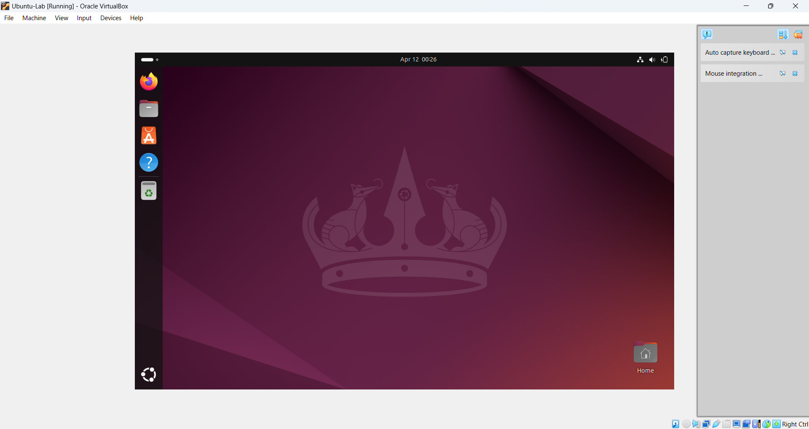

# 🛡️ Linux System Hardening & Audit Lab

---

### 📘 Description

This project focuses on building a personal cybersecurity lab using Ubuntu 22.04 LTS in VirtualBox. The goal was to simulate real-world IT and cybersecurity tasks, such as user management, firewall configuration, system auditing, and applying hardening recommendations based on audit findings.

---

### 🎯 Objectives

- Create and configure a virtual Linux environment
- Manage users and assign admin privileges
- Apply basic system hardening best practices
- Audit the system using `lynis` and implement suggested improvements
- Learn foundational Linux and cybersecurity skills for entry-level roles

---

### 💻 Environment Used

- **Host OS:** Windows 10  
- **Virtualization:** Oracle VirtualBox 7.1.6  
- **Guest OS:** Ubuntu 22.04.4 LTS  
- **Resources:** 4 GB RAM, 2 vCPUs, 20 GB Storage  

---

### 🛠️ Setup & Hardening Process

---

#### 🧱 Step 1: Virtual Machine Creation

- Installed VirtualBox and downloaded Ubuntu ISO
- Created VM with 4 GB RAM, 2 CPUs, 20 GB disk space
- Installed Ubuntu 22.04.4 LTS from ISO

**📸 Screenshot: VM Running Ubuntu**  

#### 🧑‍💻 Step 2: System Configuration

- Created a new user `analyst`
- Added user to `sudo` group for administrative access
- Enabled EFI and configured NAT networking

**📸 Screenshot: Terminal showing user creation**    

---

#### 🔐 Step 3: System Updates & Security Tools
📸 Screenshot: System update and security tools installation

**🔧 Commands Used:**

sudo apt update && sudo apt upgrade -y  
sudo apt-get dist-upgrade -y  
sudo apt install ufw fail2ban debsums unattended-upgrades -y

---

### 🧱 Step 4: Enable and Verify Security Tools
**📸 Screenshot: Enabling automatic security updates using unattended-upgrades**  

In this step, I enabled the system firewall, verified its active status, and configured the system to install important security updates automatically using unattended-upgrades.

These actions are foundational to securing Linux systems and are part of routine hardening steps used in IT support, sysadmin, and entry-level cybersecurity roles.

---

**🔧 Commands Used:**

sudo ufw enable  
sudo ufw status verbose  
sudo apt install unattended-upgrades -y  
sudo dpkg-reconfigure --priority=low unattended-upgrades

---

### 🧪 Step 5: System Security Audit with Lynis
📸 Screenshot: Lynus Audit Results  

To assess the security posture of my Ubuntu lab system, I used **Lynis**, a powerful Linux auditing tool. Lynis checks for vulnerabilities, misconfigurations, and missing hardening best practices.

---

**🔧 Commands Used:**

sudo apt install lynis -y  
sudo lynis audit system

--

### 🛠️ Remediation Step: Adding a Malware Scanner (ClamAV)
📸 Screenshot: Malware Scanner Install  

After reviewing the Lynis audit results, I noticed that no malware scanner was installed. To fix this and improve system hardening, I installed and configured **ClamAV**, an open-source antivirus engine for Linux.

**Commands Used:**

sudo apt install clamav clamav-daemon -y  
sudo systemctl start clamav-freshclam  
sudo systemctl enable clamav-freshclam

